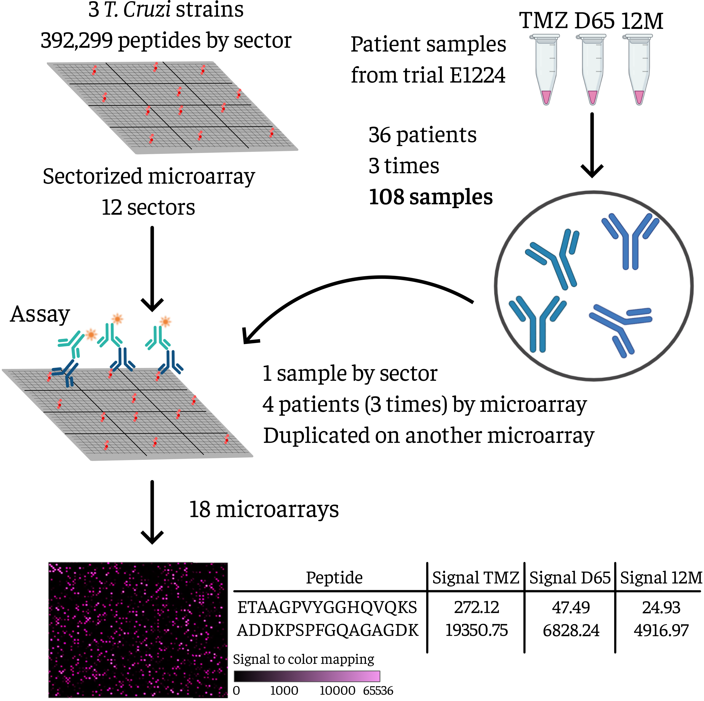
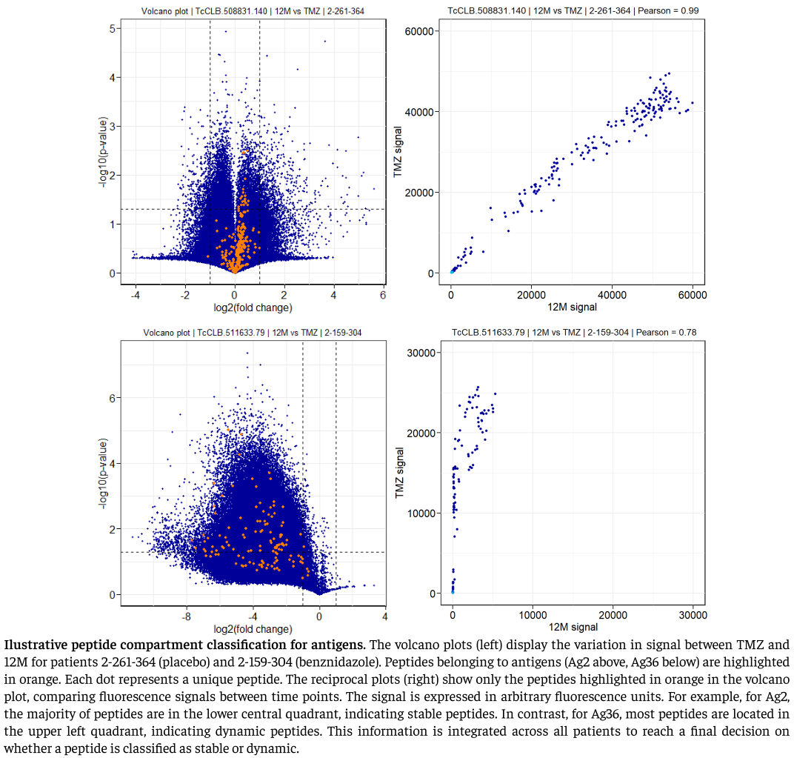

---

title: "Antibody dynamics against specific T.cruzi antigens in patients undergoing chemotherapeutic treatments"
event: "XXVII Congreso de la Federación Latinoamericana de Parasitología y XII Congreso de la Sociedad Argentina de Protozoología"
event_url: https://flap.protozoologia.org.ar/
location: Campus Monserrat de la Universidad Argentina de la Empresa (UADE), Ciudad de Buenos Aires
address:
  street: Lima 717
  city: CABA
  region: Buenos Aires
  postcode:
  country: Argentina 
summary:
abstract:

# Talk start and end times.
#   End time can optionally be hidden by prefixing the line with `#`.
date: 2024-11-27T18:00:00-03:00
date_end: 2024-11-27T20:00:00-03:00
all_day: false

authors: ["Ramiro Quinteros", "Alejandro Ricci", "Isabela Ribeiro", "Sergio Sosa-Estani", "Maria Jesús Pinazo", "Cristina Alonso Vega", "Joaquim Gascon", "Faustino Torrico", "Fernán Agüero"]
tags: ["antibody-dynamics","chagas-disease"]

# Is this a featured talk? (true/false)
featured: false

# Featured image
# To use, add an image named `featured.jpg/png` to your page's folder. 
# Focal points: Smart, Center, TopLeft, Top, TopRight, Left, Right, BottomLeft, Bottom, BottomRight.
image:
  caption: ""
  focal_point: ""
  preview_only: false

# Custom links (optional).
#   Uncomment and edit lines below to show custom links.
# links:
# - name: Follow
#   url: https://twitter.com
#   icon_pack: fab
#   icon: twitter

# Optional filename of your slides within your talk's folder or a URL.
url_slides:

url_code:
url_pdf:
url_video:

# Markdown Slides (optional).
#   Associate this talk with Markdown slides.
#   Simply enter your slide deck's filename without extension.
#   E.g. `slides = "example-slides"` references `content/slides/example-slides.md`.
#   Otherwise, set `slides = ""`.
slides: ""

# Projects (optional).
#   Associate this post with one or more of your projects.
#   Simply enter your project's folder or file name without extension.
#   E.g. `projects = ["internal-project"]` references `content/project/deep-learning/index.md`.
#   Otherwise, set `projects = []`.
projects: ["immunomics"]
---

## Abstract

Currently available first-line antiparasitic treatments against Chagas disease can produce adverse side effects and are not fully effective in the chronic stage of the disease. As a result, there is a sustained research effort to discover new chemical entities and therapeutic formulations to feed clinical development pipelines for Chagas disease. Eventually these drugs will enter a clinical study to evaluate their efficacy. However, there are known difficulties in assessing therapeutic efficacy in patients in the chronic stage: subclinical parasitemia makes circulating parasites difficult to detect either by direct observation or by molecular methods (PCR). For this reason, serological detection of *T. cruzi* is preferable. Specific antibodies against the parasite decay when the parasite is eliminated, but complete seroreversion  takes years. In our laboratory, we recently developed *the Atlas of Antigens and Epitopes of Chagas Disease*, which provides thousands of defined antigenic markers and information on the antibody repertoires of 71 patients from diverse human populations. 
In this work we seek to analyze the dynamics of specific antibodies of patients undergoing chemotherapeutic treatments. For this, we used CHAGASTOPE-v2 high-density peptide microarrays assayed with samples from 36 patients from the benznidazole, E1224-high-dose or placebo arms (12 patients per arm). For each patient we analyzed 3 samples, obtained at recruitment, end-of-treatment, and after a 1-year follow-up. All assays were performed in duplicate. We compared antibody-binding signals of samples from the same patient over time, for 392,299 *T. cruzi* peptides.
As a result we identified two main antibody compartments with different dynamic behavior over time. One compartment was more dynamic and displayed larger signal changes, whereas the other was more stable. The antigens found in each compartment are clearly defined. A small subset of 31 peptides was prioritized based on stable and dynamic compartment associations, signal magnitude, and seroprevalence.
We will explore correlations of these serological markers with other clinical or molecular data linked to treatment failure or success.

## Clinical trial

### Times

### CHAGASTOPE-v2 microarray assay

## Humoral dynamics

A differential behavior in humoral dynamics was observed between patients. Three types of cases could be identified in the different branches of the study: negativization, positivization and no change.
In the no-change case, the antibody signals belonging to the different peptides remained approximately constant over time.
In the case of negativization, it was observed how the signal decreased for a majority group of peptides that had high or medium signals at TMZ time, and that at time D65 or 12M had low signals, close to zero. Another group of peptides remained with their constant signal.
In the case of positivization, the opposite of the previous case was observed, the signal increased for a group of peptides with respect to time zero. While for another group of peptides the signal remained constant.

## Compartments in the antibody repertoire

Due to the analysis of all patients, two main peptide compartments could be identified. The first compartment was a more **stable** one, where the signal coming from these peptides had little or no variation. In the second, more **dynamic** compartment, the signals of their peptides changed significantly over time, either showing an increase or a decrease in signal.

## Peptide prioritization

From a total of approximately 350,000 peptides from *T. cruzi*, a subset of peptides was prioritized based on their stable and dynamic compartment associations. This selection considered signal magnitude, seroprevalence (including data from the E1224 assay and *The Trypanosoma cruzi Antigen and Epitope Atlas*, which covered six different countries in the Americas), and the number of patients in which the peptide was associated with either the stable or dynamic compartment. A scoring system, normalizing each term to its maximum value, was developed to integrate these criteria. Peptides with the highest scores were prioritized, retaining only one peptide per epitope. This resulted in a set of prioritized markers for both stable and dynamic compartments. Peptides showing reactivity in negative serum pools from *The Trypanosoma cruzi Antigen and Epitope Atlas* were excluded. For potential assays, peptide designs were further optimized for synthesis. This design incorporated epitope information obtained from prior AlanineScan analysis for antigens where this assay was available.

## Conclusions

The treatments did not have a uniform effect on the patients' antibody repertoire. Different patients showed varying changes in their antibody repertoire in response to treatment. Three types of humoral dynamics were observed among the patients: no change, seronegativity, and seropositivity. These three types of humoral dynamics were observed in each of the three treatment groups. In most patients, the antibody repertoire was the same or very similar between the end of treatment and the end of follow-up, though not in all cases.
Two main antibody compartments with distinct dynamic behavior over time were identified. In the stable compartment, antibodies specific to a group of peptides remained constant over time, while in the variable compartment, the signal showed significant changes, either increasing or decreasing over time.
The antigens identified in each compartment are clearly defined. From a total of approximately 350,000 peptides from *T. cruzi*, a small subset of peptides was prioritized based on their stable and dynamic compartment associations.  In this analysis, the signal magnitude representing the epitope-antibody binding, the seroprevalence (including data from the E1224 assay and *The Trypanosoma cruzi Antigen and Epitope Atlas*, which covered six different countries in the Americas), and the number of patients in which the peptide was associated with either the stable or dynamic compartment were considered. Using these parameters, a scoring system was created to integrate these criteria, prioritizing a small number of peptides with the highest scores. A total of 31 peptides were selected, 17 of these peptides belonged to the stable compartment and 14 to the dynamic compartment, representing a total of 19 different proteins. These prioritized peptides were synthesized for future assays and investigations of the natural and treatment-induced dynamics of antibodies, as well as for potential use in patient monitoring tests.
Together with DNDi, correlations between these serological markers and other clinical or molecular data related to treatment success or failure will be investigated. 